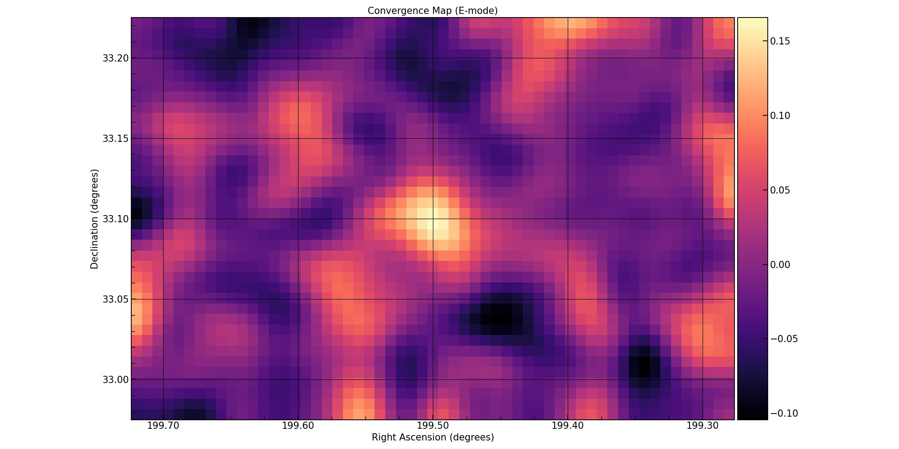

# SMPy (Shear Mapping in Python)

## Overview
**SMPy (Shear Mapping in Python)** is a mass reconstruction toolkit for weak gravitational lensing analysis, primarily focused on mapping total matter distributions from galaxy shear data. The package implements the Kaiser-Squires inversion technique (Kaiser & Squires 1993) to reconstruct the dimensionless surface mass density (convergence) field from weak lensing shear measurements. This non-parametric reconstruction method enables direct mapping of both dark and baryonic matter distributions from the observed distortions in background galaxy shapes.

Key attributes include:
- Mass reconstruction via Kaiser-Squires inversion in both celestial (RA/Dec) and pixel coordinate systems
- E/B-mode decomposition for systematic error analysis
- Signal-to-noise ratio quantification through spatial and orientation randomization techniques
- Peak statistics with customizable detection thresholds and significance estimation
- Intuitive and 'Pythonic' repository and code structure

The package provides a robust implementation supporting both weighted and unweighted shear catalogs, with built-in handling of spherical geometry for wide-field observations and flexible gridding schemes for irregular galaxy distributions. This project aims to provide a robust, intuitive, and accessible way to create convergence maps from weak lensing data for astrophysicists of all levels.

## Features
### Convergence Mapping
- **Kaiser-Squires Inversion**: Implementation of the classic Kaiser & Squires (1993) method for reconstructing convergence maps from weak lensing shear data
- **Support for Both E-mode and B-mode**: Generate maps for both E-mode (physical) and B-mode (systematic check) signals
- **Flexible Coordinate Systems**: 
  - RA/Dec celestial coordinates with accurate spherical geometry handling
  - Pixel-based coordinates for direct image analysis
  - Automatic coordinate transformations and scaling

### Signal Processing & Error Analysis
- **Filtering**: Gaussian smoothing with configurable kernel sizes, with additional filters planned
- **Signal-to-Noise Maps**: Generate SNR maps using two different randomization techniques:
  - Spatial shuffling: Randomizes galaxy positions while preserving shear values
  - Orientation shuffling: Randomizes galaxy orientations while preserving positions
- **Peak Detection**: Automated identification of significant peaks in convergence maps with customizable detection thresholds

### Data Handling
- **FITS File Support**: Direct reading of astronomical FITS catalogs
- **Flexible Data Input**: Support for various column naming conventions and data formats
- **Optional Weighting**: Handle weighted and unweighted shear measurements
- **Automatic Grid Generation**: Smart binning of irregular galaxy distributions onto regular grids

### Visualization
- **Customizable Plotting**: 
  - Adjustable color schemes and scaling
  - Optional grid lines and coordinate labels
  - Automatic or manual axis labeling
  - Customizable figure sizes and titles
- **Peak Annotation**: Option to mark and label detected peaks automatically or via manual input
- **WCS Integration**: Proper coordinate system handling in output plots

### Configuration & Usability
- **YAML Configuration**: Easy-to-use YAML configuration files for full control over:
  - Input/output paths and formats
  - Mapping parameters and methods
  - Visualization settings
  - SNR calculation parameters
- **Multiple Interfaces**: 
  - Command-line interface using a runner script
  - Python API for notebook integration
- **Modular Design**: Extensible architecture ready for implementing additional mapping methods (aperture mass coming soon 🚧)

## Installation

1. **Prerequisites**: Ensure you have Python 3.x installed on your system. SMPy also requires `numpy`, `scipy`, `pandas`, `astropy`, `matplotlib`, and `pyyaml` for numerical computations and visualizations.

2. **Clone the Repository**: Clone the SMPy repository to your local machine using git:

   ```bash
   git clone https://github.com/GeorgeVassilakis/SMPy.git
   ```

3. **Install the Package:** Install SMPy using setup.py:

   ```bash
   pip install .
   ```

## How to Run
### With runner script
1. **Prepare your configuration file**
   - Copy and modify the example configuration file from `smpy/configs/example_config.yaml`
   - Set your input/output paths and data-specific parameters (coordinate system type, shear column names, etc.)
   - Configure visualization settings like smoothing, color maps, and plot titles

2. **Run the runner.py script:** Use the `-c` or `-config` flag to pass your .yaml file
   
   ```bash
   python runner.py -c /path/to/example_config.yaml
   ```

### With Jupyter Notebook
1. Import the run module:
   ```python
   from smpy import run
   ```

2. Copy and edit the `example_config.yaml` configuration file.

3. Define config path and run:
   ```python
   config_path = '/path/to/SMPy/smpy/configs/example_config.yaml'
   run.run(config_path)
   ```

## Example Kaiser Squires Convergence Map

